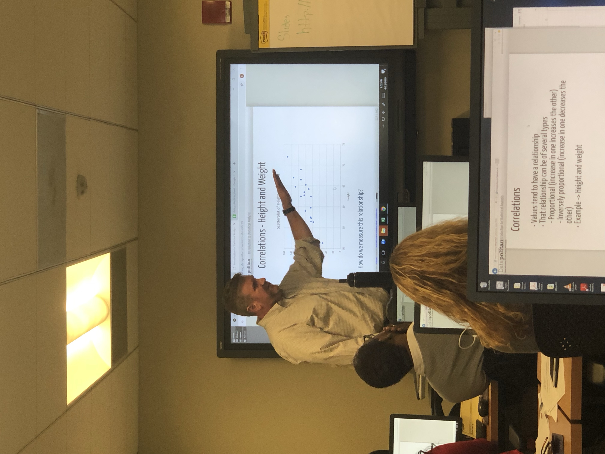
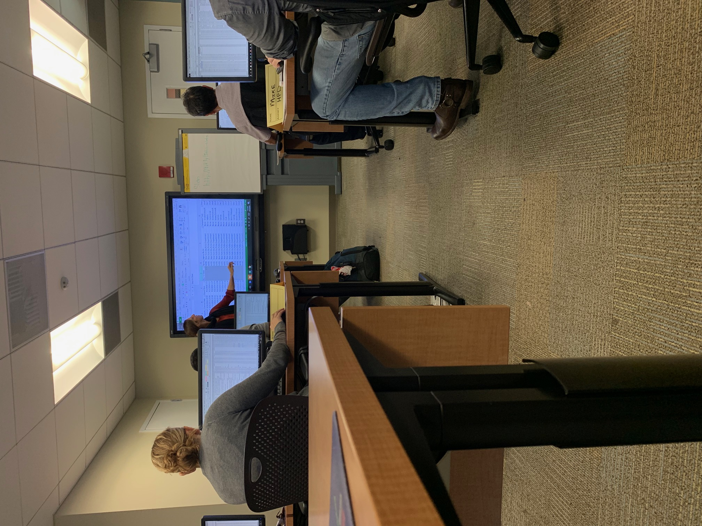
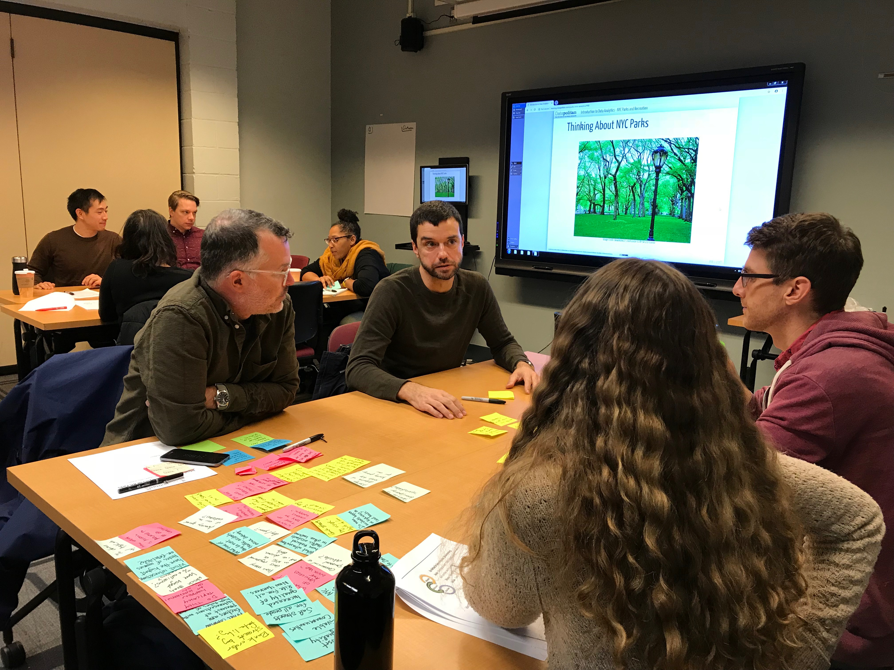

layout:true

  
  
Datapolitan Capabilities

  

    
    
      
      

--
class: center,middle

<!-- background-image: url(images/city_crop.png)
background-position: top
background-size: 700px -->

# Datapolitan Capabilities

- - -

## Presenter: Richard Dunks

### Follow along at: https://bit.ly/datapolitan-capabilities

#### See the code at: https://bit.ly/datapolitan-capabilities-code

<strong><strong>Datapolitan Capabilities</strong></strong> by <a xmlns:cc="http://creativecommons.org/ns#" href="http://www.datapolitan.com" property="cc:attributionName" rel="cc:attributionURL">Richard Dunks</a> is licensed under a <a rel="license" href="http://creativecommons.org/licenses/by-sa/4.0/">Creative Commons Attribution-ShareAlike 4.0 International License</a>

---

# Background
--

+ Started in 2014 teaching Data Analytics for Managers for NYC leaders
--

+ Also provided analytics consulting to NYC agencies and social service nonprofit organizations
--

+ Provided additional training classes to NYC employees at all levels (junior staff to senior management)
--

+ As of 2023, have taught over 200 classes to well over 2,500 learners
--

+ As of 2023, have provided consulting work with over 15 clients around the country

---

# Values

.caption[Click the image for a blogpost on our values]

---
class:center,middle

# Classes and Topics

---

# Spreadsheets

--

+ Introduction to Data Analytics
--

+ Introduction to Open Data
--

+ Data Analysis with Excel
--

+ Data Analysis with Google Sheets
--

+ Introduction to Statistical Analysis with Excel

---

# GIS/Visualization

--

+ Data Visualization with Excel
--

+ Introduction to Open Source Mapping
--

+ Introduction to GIS Fundamentals
--

+ Intermediate GIS with QGIS and PostGIS
--

+ Advanced Data Analysis with GIS

---

# Progamming/Management

--

+ Data Analysis with R
--

+ Data Analysis with Python
--

+ Advanced Data Analysis with SQL
--

+ Data Analytics for Managers
--

+ Leveraging Analytics

---

# Resources
+ Our <a href="https://medium.com/datapolitan-training-playbook" target="_blank">Training Playbook</a>
+ Our <a href="https://medium.com/leading-with-data" target="_blank">Leading with Data Medium publication</a>
+ Our <a href="https://github.com/Datapolitan-Training" target="_blank">Github repository of courses</a>

---

# Final Thought

Our purpose is to help center data more in our public conversations so we can create a more fair, equitable, and just society in which everyone benefits.

---

# Contact Information
+ [Email us](mailto:training[at]datapolitan[dot]com)
+ Check out [our website](https://wwww.datapolitan.com) (currently under construction)
+ Connect on [Twitter](https://twitter.com/Datapolitan)
+ Connect on [LinkedIn](https://www.linkedin.com/company/datapolitan/)
+ Follow us on [Instagram](https://www.instagram.com/datapolitan/)

---

class:middle,center
# Thank You!

